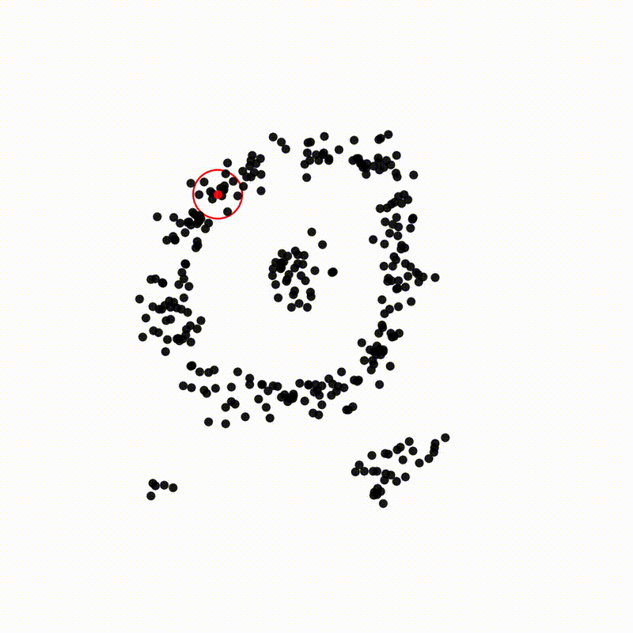

# Interactive DBSCAN Visualizer

An interactive tool to visualize the DBSCAN clustering algorithm on a 2D canvas. Users can draw points, adjust parameters, run the clustering algorithm with a visual animation, and optionally export the animation as a video file.

## Features
- Draw points with adjustable brush size and density on a canvas.
- Customize DBSCAN parameters such as radius (`epsilon`) and minimum points (`minPts`).
- View the animation of the clustering process in real-time.
- Export the animation as a video (`dbscan_animation.mp4`) to the `Downloads` folder.
- Adjustable animation speed for better visualization.

## Demo



## Installation

### Requirements
- **Python 3.x**
- **Tkinter** (usually included with Python)
- **Matplotlib**
- **NumPy**
- **FFmpeg** (for exporting animations as video)

### Steps to Install Dependencies
Clone the repository (after publishing to GitHub):

   ```bash
   git clone https://github.com/K-XZY/DBSCAN_viz.git
cd BDSCAN_viz
```
Install dependencies and run the code:
```bash
   pip install -r requirements.txt
   python dbscan_visualizer.py
   ```
